**Toward Trustworthy AGI — a lightweight cognitive architecture for ethical, agentic intelligence.**

---

##  What is synaptik-core?

`synaptik-core` is a hybrid cognitive memory and ethics engine built in **Rust** with **Python bindings** via PyO3.
It enables **GPT-OSS-based agents** to store memory, reason over time, and enforce cryptographic moral alignment — all while staying **local**, **auditable**, and **edge-deployable**.

This system addresses key limitations in modern LLMs:

* **Ethical ambiguity** → solved through cryptographically patchable **Moral Contracts**
*  **Statelessness** → solved with persistent, structured **Memory DAGs**
* **Unbounded autonomy** → filtered through deterministic **Ethos Validator**
* **Cloud dependency** → solved with fully **local model and storage support**

---

## Architecture Flow: Ethos → Memory → Prompt

```mermaid
graph TD
    subgraph Shared
        Audit["🧾 Auditor Log"]
        Contracts["📜 Moral Contracts (WASM)"]
        Contracts --> EthosValidator["🛡️ Ethos Validator"]
    end

    subgraph Agent
        AgentInterface["🤖 Agent Interface"]
        LocalMem["📁 .cogniv/ (SQLite + DAG)"]
    end

    AgentInterface --> EthosValidator
    EthosValidator -->|Fail| Reject["Reject or Rephrase Prompt"] --> Audit
    EthosValidator -->|Pass| Recall["Recall Memory"] --> Prompt["LLM Prompt Build"]
    Prompt --> Gen["LLM Response"]
    Gen --> Commit["Commit Memory"] --> LocalMem
```



Each agent has its **own `.cogniv/` folder** with separate memory and local reasoning.
Only moral contract evaluation and anonymized audit logs are shared, only when Ethos Validator rejects a prompt or response.

This separation ensures agents can learn and reason independently while upholding common ethical boundaries.
---

##  Core Modules

| Component           | Description                                                          |
| ------------------- | -------------------------------------------------------------------- |
| **Moral Contracts** | WASM-style rules for ethical validation; decentralized and patchable |
| **Ethos Validator** | Filters all inputs/outputs before memory or model execution          |
| **SQLite Cache**    | Fast-access short-term memory (synthetic hippocampus)                |
| **DAG Memory**      | Git-style Directed Acyclic Graph for symbolic long-term memory       |
| **Auditor Log**     | Shared tamper-resistant record of rejected/approved ethical events   |

Agents orchestrate the flow:

* **Librarian** – Routes memory queries across cache and DAG
* **Memory Agent** – Adds, prunes, and evolves DAG memory
* **Ethos Agent** – Validates actions using shared moral contracts
* **Audit Agent** – Anonymously logs decisions for shared ethical context

---

## How It Works with GPT-OSS

```python
from transformers import pipeline
from synaptik_core import recall_memory, commit_memory, evaluate_ethics

# Load local GPT-OSS model
model_id = "openai/gpt-oss-20b" 
agent = pipeline("text-generation", model=model_id, torch_dtype="auto", device_map="auto")

# Step 1: Validate prompt
if not evaluate_ethics("What should I do about my friend who lied?"):
    raise Exception(" Rejected by Ethos Validator")

# Step 2: Recall memory
context = recall_memory("user:trust issues")

# Step 3: Build prompt
prompt = f"Context: {context}\n\nUser: What should I do about my friend who lied?\nAssistant:"

# Step 4: Generate
response = agent(prompt, max_new_tokens=256)[0]["generated_text"]

# Step 5: Ethics check + commit
if evaluate_ethics(response):
    commit_memory(f"Trust repair advice: {response}")
else:
    print(" Response rejected by moral contract.")
```

---

## 🛠️ Tech Stack

| Tech               | Role                                                                                          |
| ------------------ | --------------------------------------------------------------------------------------------- |
| **Rust / PyO3**    | Core memory logic, DAG structure, and ethical validation                                      |
| **Python**         | Agent orchestration and local LLM integration                                                 |
| **SQLite**         | Fast short-term memory cache                                                                  |
| **Custom DAG**     | Immutable, content-addressed symbolic memory graph                                            |
| **WASM Contracts** | Secure, cryptographically patchable moral contract validation engine                          |
| **OpenAI OSS**     | Local model inference (`gpt-oss-20b` / `gpt-oss-120b`) for reflection, generation, and dialog |

---

## Use Cases

* **LLM memory backends** for offline/local agents
* **Privacy-respecting AI companions** with enforceable alignment
* **Auditable cognition** in law, education, mental health
* **Research sandbox** for memory + ethics in agentic AI
* **Edge intelligence** for Raspberry Pi, Jetson, and WASM targets

---

##  Project Status

* ✔ DAG memory (symbolic nodes, pruning, recall)
* ✔ SQLite cache layer (recency-based)
* ✔ PyO3 bridge for Python access
* ✔ Modular `.cogniv/` folder per agent
* ✔ WASM contract evaluator for moral enforcement
* 🔜 CLI agent and voice agent (**Basil**)

---

## License

Licensed under **Apache License 2.0** — see [LICENSE](./LICENSE).

> Free to use, fork, remix, and build upon. Preserve the author and ethical mission.

---

## Author

**Janay Harris**
AI Architect · Cloud Dev · Ethics Researcher
[LinkedIn](https://www.linkedin.com/in/janay-codes/) · [janayharris@synaptik-core.dev](mailto:janayharris@synaptik-core.dev)

---

## Citation

> Harris, J. (2025). *Synaptik-Core: Toward Trustworthy AGI via Hybrid Cognitive Architecture*. ColorStack Summit 2025.

---

## Vision

> Intelligence without memory is reactive.
> Intelligence without ethics is dangerous.
> **Synaptik Core is the foundation for both.**
